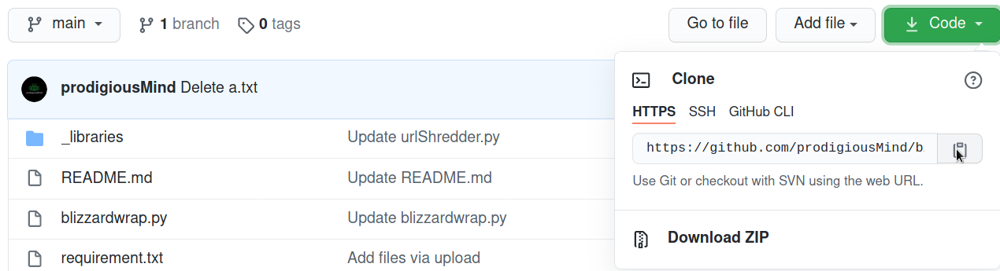
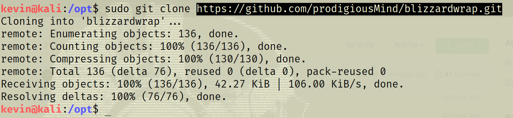
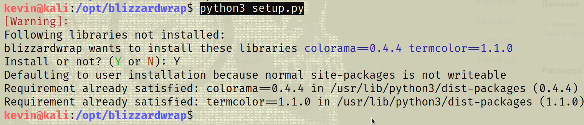
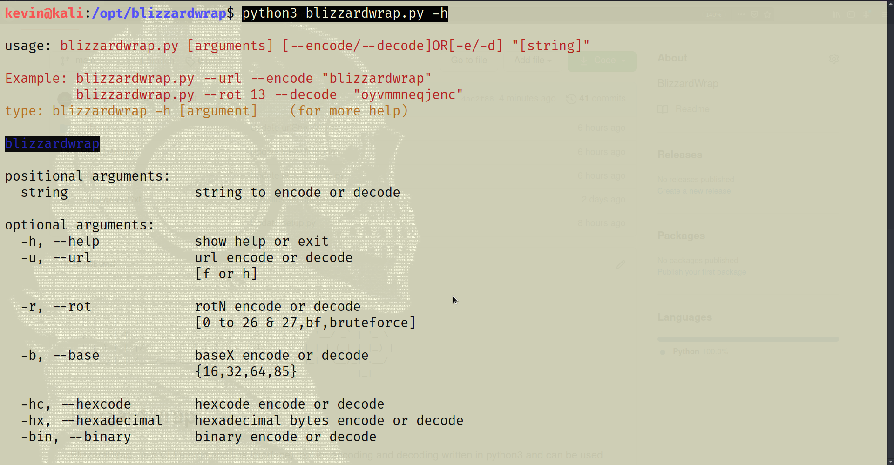
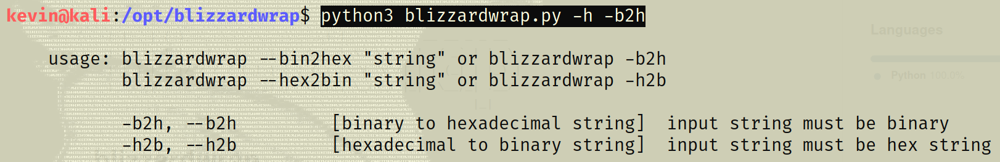
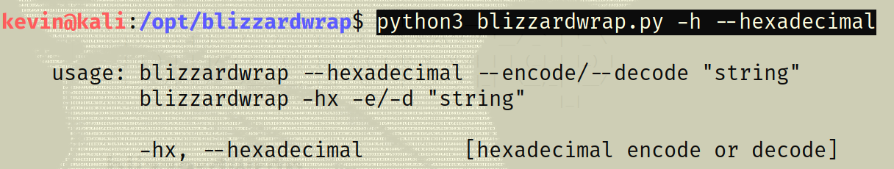

     _     _ _                      _                          
    | |__ | (_)__________ _ _ __ __| |_      ___ __ __ _ _ __  
    | '_ \| | |_  /_  / _` | '__/ _` \ \ /\ / / '__/ _` | '_ \ 
    | |_) | | |/ / / / (_| | | | (_| |\ V  V /| | | (_| | |_) |
    |_.__/|_|_/___/___\__,_|_|  \__,_| \_/\_/ |_|  \__,_| .__/ 
                                                        |_|    
                                        

# blizzardwrap
BlizzardWrap - is a CLI (command line interface) tool for encoding and decoding written in python3
and can be used for encoding or decoding in several formats.
like URL,MorseCode,HTMLEntities,Binary,Hexadecimal,Hexcode,ROT,Base64,Base32,Base16,Base85,Binary2Hex,Hex2Binary encoding & decoding.

How to install?
you can simply clone this whole repository and use it.
or you can download it in a compressed file format.

After installing?
python3 -m pip install -r requirement.txt   (for linux and macOS)
Or
python -m pip install -r requirement.txt    (for windows)

OR Just Run setup.py
run setup.py by:
python3 setup.py

python3 blizzardwrap.py -h

python3 blizzardwrap.py -h [argument]   (for more help)

  
